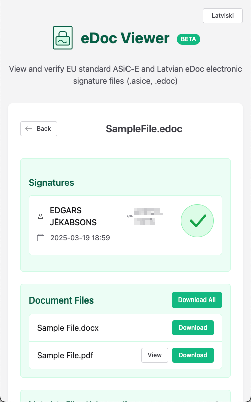

# eDoc Viewer

A modern viewer for EU standard ASiC-E containers and Latvian eDoc files. Works as a progressive web application.



## Features

- View and verify signatures in eDoc and ASiC-E containers
- Download files contained within the container
- View supported document types directly in the browser
- Multilingual support (English, Latvian)
- Drag and drop file upload
- File handling for .edoc and .asice files through Progressive Web App functionality

## Application

The web application allows users to:

1. Upload eDoc files through drag & drop or file selection
2. View file signatures and verification status
3. Access document files contained in the container
4. Download the original container or its contents

## PWA capabilities

The Progressive Web Application (PWA) capabilities provide:

1. Offline access to the viewer
2. File handling for .edoc and .asice files directly in your operating system
3. Same viewing capabilities as the web application

## Development

### Prerequisites

- Node.js (v22 recommended)
- npm (v10 or higher)

### Installation

1. Clone the repository
   ```
   git clone https://github.com/yourusername/edoc-viewer.git
   cd edoc-viewer
   ```

2. Install dependencies
   ```
   npm install
   ```

### Development Server

Run the development server for the web application:

```
npm run dev
```

The application will be available at http://localhost:8080.

### Building

Build the web application:

```
npm run build
```

### Localization

Extract messages for localization:
```
npm run localize:extract
```

Build localized versions:
```
npm run localize:build
```

## Technology Stack

- TypeScript
- Lit 3.x for web components
- @lit/localize for internationalization
- Tailwind CSS for styling
- @shoelace-style/shoelace for UI components
- edockit library for ASiC-E/eDoc parsing
- Webpack 5 for bundling with optimization for:
  - Separate bundle for edockit and dependencies
  - Separate bundle for web components
  - Optimized localization bundle
- Workbox for PWA service worker

## License

MIT - See LICENSE file for details.
